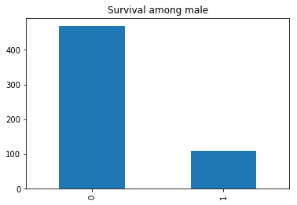
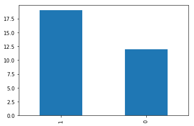
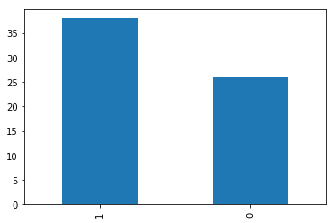
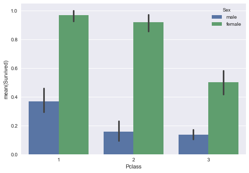
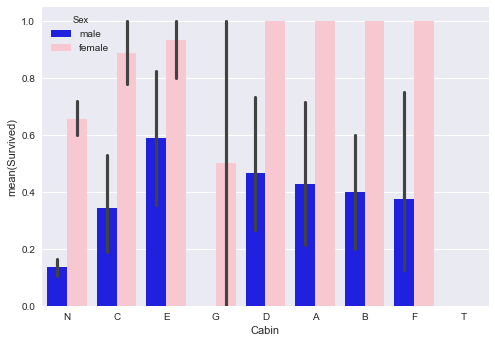
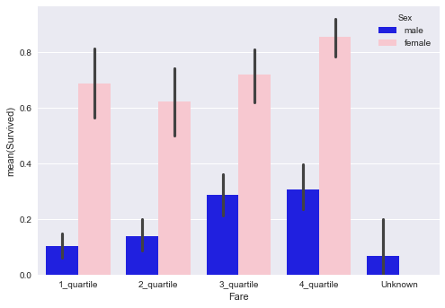

_Newbe to Kaggle and datascience in general. As I am creating my first kernel for the Titanic Survival prediction model (in python) I wrote down everything that I thought was unclear at first. The goal I set for myself was to get everythng working, create a model that predicted at least somewhat better than chance alone, and upload it to Kaggle.<br> I hope this is useful to newbe kagglers like myself._

***

### 1 Decsisions to make before starting your first datascience project (kaggle titanic..)
-First: the decision to either work 'within' Kaggle (the kaggle kernel) or use use your own downloadable platform. 
-Second: 'Python or R?'

#### First decision:
What is meant by 'own platform'?
You can do all of this outside of Kaggle and then upload (/copy paste code) to kaggle when done. Obviously this requires some setup but the advantages are that you know where you stand when doing datascience projects oustide of kaggle. The setup is made quite easy by means of an application called 'anaconda navigator' which also has other benefits so I stronlgy suggest using this if going for your own setup.

#### Second decision:
Discussion has been going forever. Rivalling the tabs vs spaces debate :P #piedpiper Being horrible at the javascript syntax I choose python because of its syntaxical ease but both have their advantages and disadvantages. 
Most important take-away; eiter will be fine, if starting choose the language your (desired) job/company uses.


### 2 Getting started:
- 2A: Orienting Yourself
- 2B: Having a looksy at the data (or Exploratory Data Analysis (EDA))

### 3 Data prepping & further visualization

### 4 Modelling

### 5 Submission
<br>
***

### 1A: Getting started: Orienting Yourself
First things first. Even before looking at your data you want to orient yourself _(at least you want to do this if you are new to jupyter notebook and kaggle kernels like me)._ See 'where are working from' and if necesary change your working directory to where you have saved your data files (csv's). <br>To do this you need:
<li>import os   _#to be able to use the os. commands_
<li>os.getcwd()   _#to find were you are working from now (like 'pwd' in unix)_
<li>os.chdir('....path..')   _#to change from you current direcotory to you desired directory (e.g. where your data csv's are). Like 'cd' in unix._<br>

_#If you are working fully within a kaggle kernel you can skip this. But is might be good to do this anyway for potential troubleshooting purposes in the future._


```python
import os
os.getcwd()
```


    '/Users/steven'


<br>
So we see we are currently set in Users/steven. This is not where I want to be because I have not -and do not want to- save my data files (csv's) here. 

So I look up were the folder is that contains the CSV's (train.csv & test.csv downloaded from kaggle) I intend to use.<br>

_You do this outside Jupyter, by just looking on your computer and looking at the path. For me it is /Users/steven/Documents/Kaggle/Titanic so this will be used in the following command.<br>_

_# This is case sensitive so pay attention to
whether your folders on your PC start with or without uppercase!_


```python
os.chdir('/Users/steven/Documents/Kaggle/Titanic')
```

<br>
Now we check by using same command as before _(and we see it is correct because it prints out the directory we wanted)_:
<br>
<br>


```python
os.getcwd()
```


    '/Users/steven/Documents/Kaggle/Titanic'


***
<br>
### 1B: Getting started: Having a looksy at the data ("EDA")

So now you are ready to start. You want to look a bit at the data. Two (there are a lot more) basic ways are;
- 1: open your data files (csv's) with excel, save a copy as .xls and in excel go to the data tab and use the text to data wizard to use the comma's to seperate fields.<br>
_the advantage of this is that after having a quick look you can you pivot tables functionality in excel to look deeper_
- 2: show data in your jupyter notebook


Let's assume you have already done number 1 (opening in excel and looking in the data, ideally using a pivot table). If you are starting at kaggle I am going to assume you are familiar with excel basics..
For number 2 (data in jupyter notebooke/kaggle kernel) first step in to import a library that helps you work with csv files called 'pandas' _(this is your 'csv-reader' and allows you to create dataframes_ :


```python
import pandas as pd
```


```python
%pylab inline  
# the %pylab statement here is just something to make sure visualizations we will make later on 
# will be printed within this window..
```

    Populating the interactive namespace from numpy and matplotlib


```python
train_df = pd.read_csv('train.csv', header=0)
#above is the basic command to 'import' your csv data. Df is the new name for your 'imported' data 
#(df is short for dataframe, you can name this anyway you want, but including 'df' in your name is convention)

test_df = pd.read_csv('test.csv', header=0)
#you don't have to use the test set but I am doing this to eveluate the model without uploading. You can slip this.

train_df.head(2)
#with df.head(2) we can 'test' by previewing the first(head) 2 rows(2) of the dataframe(df)
#You can see the final x by using 'df.tail(x)  (replace x with number of rows)
```


<div>
<style>
    .dataframe thead tr:only-child th {
        text-align: right;
    }

    .dataframe thead th {
        text-align: left;
    }

    .dataframe tbody tr th {
        vertical-align: top;
    }
</style>
<table border="1" class="dataframe">
  <thead>
    <tr style="text-align: right;">
      <th></th>
      <th>PassengerId</th>
      <th>Survived</th>
      <th>Pclass</th>
      <th>Name</th>
      <th>Sex</th>
      <th>Age</th>
      <th>SibSp</th>
      <th>Parch</th>
      <th>Ticket</th>
      <th>Fare</th>
      <th>Cabin</th>
      <th>Embarked</th>
    </tr>
  </thead>
  <tbody>
    <tr>
      <th>0</th>
      <td>1</td>
      <td>0</td>
      <td>3</td>
      <td>Braund, Mr. Owen Harris</td>
      <td>male</td>
      <td>22.0</td>
      <td>1</td>
      <td>0</td>
      <td>A/5 21171</td>
      <td>7.2500</td>
      <td>NaN</td>
      <td>S</td>
    </tr>
    <tr>
      <th>1</th>
      <td>2</td>
      <td>1</td>
      <td>1</td>
      <td>Cumings, Mrs. John Bradley (Florence Briggs Th...</td>
      <td>female</td>
      <td>38.0</td>
      <td>1</td>
      <td>0</td>
      <td>PC 17599</td>
      <td>71.2833</td>
      <td>C85</td>
      <td>C</td>
    </tr>
  </tbody>
</table>
</div>


```python
train_df
#show full dataset (df). (if very large this can be very inconvenient but with our trainset it's ok)
#notice it adds a rows total and columns total underneath (troubleshooting: if you do not see these totals
# you can seperatly create this by using 'df.shape')
```


<div>
<style>
    .dataframe thead tr:only-child th {
        text-align: right;
    }

    .dataframe thead th {
        text-align: left;
    }

    .dataframe tbody tr th {
        vertical-align: top;
    }
</style>
<table border="1" class="dataframe">
  <thead>
    <tr style="text-align: right;">
      <th></th>
      <th>PassengerId</th>
      <th>Survived</th>
      <th>Pclass</th>
      <th>Name</th>
      <th>Sex</th>
      <th>Age</th>
      <th>SibSp</th>
      <th>Parch</th>
      <th>Ticket</th>
      <th>Fare</th>
      <th>Cabin</th>
      <th>Embarked</th>
    </tr>
  </thead>
  <tbody>
    <tr>
      <th>0</th>
      <td>1</td>
      <td>0</td>
      <td>3</td>
      <td>Braund, Mr. Owen Harris</td>
      <td>male</td>
      <td>22.0</td>
      <td>1</td>
      <td>0</td>
      <td>A/5 21171</td>
      <td>7.2500</td>
      <td>NaN</td>
      <td>S</td>
    </tr>
    <tr>
      <th>1</th>
      <td>2</td>
      <td>1</td>
      <td>1</td>
      <td>Cumings, Mrs. John Bradley (Florence Briggs Th...</td>
      <td>female</td>
      <td>38.0</td>
      <td>1</td>
      <td>0</td>
      <td>PC 17599</td>
      <td>71.2833</td>
      <td>C85</td>
      <td>C</td>
    </tr>
    <tr>
      <th>2</th>
      <td>3</td>
      <td>1</td>
      <td>3</td>
      <td>Heikkinen, Miss. Laina</td>
      <td>female</td>
      <td>26.0</td>
      <td>0</td>
      <td>0</td>
      <td>STON/O2. 3101282</td>
      <td>7.9250</td>
      <td>NaN</td>
      <td>S</td>
    </tr>
    <tr>
      <th>3</th>
      <td>4</td>
      <td>1</td>
      <td>1</td>
      <td>Futrelle, Mrs. Jacques Heath (Lily May Peel)</td>
      <td>female</td>
      <td>35.0</td>
      <td>1</td>
      <td>0</td>
      <td>113803</td>
      <td>53.1000</td>
      <td>C123</td>
      <td>S</td>
    </tr>
    <tr>
      <th>4</th>
      <td>5</td>
      <td>0</td>
      <td>3</td>
      <td>Allen, Mr. William Henry</td>
      <td>male</td>
      <td>35.0</td>
      <td>0</td>
      <td>0</td>
      <td>373450</td>
      <td>8.0500</td>
      <td>NaN</td>
      <td>S</td>
    </tr>
    <tr>
      <th>5</th>
      <td>6</td>
      <td>0</td>
      <td>3</td>
      <td>Moran, Mr. James</td>
      <td>male</td>
      <td>NaN</td>
      <td>0</td>
      <td>0</td>
      <td>330877</td>
      <td>8.4583</td>
      <td>NaN</td>
      <td>Q</td>
    </tr>
    <tr>
      <th>6</th>
      <td>7</td>
      <td>0</td>
      <td>1</td>
      <td>McCarthy, Mr. Timothy J</td>
      <td>male</td>
      <td>54.0</td>
      <td>0</td>
      <td>0</td>
      <td>17463</td>
      <td>51.8625</td>
      <td>E46</td>
      <td>S</td>
    </tr>
    <tr>
      <th>7</th>
      <td>8</td>
      <td>0</td>
      <td>3</td>
      <td>Palsson, Master. Gosta Leonard</td>
      <td>male</td>
      <td>2.0</td>
      <td>3</td>
      <td>1</td>
      <td>349909</td>
      <td>21.0750</td>
      <td>NaN</td>
      <td>S</td>
    </tr>
    <tr>
      <th>8</th>
      <td>9</td>
      <td>1</td>
      <td>3</td>
      <td>Johnson, Mrs. Oscar W (Elisabeth Vilhelmina Berg)</td>
      <td>female</td>
      <td>27.0</td>
      <td>0</td>
      <td>2</td>
      <td>347742</td>
      <td>11.1333</td>
      <td>NaN</td>
      <td>S</td>
    </tr>
    <tr>
      <th>9</th>
      <td>10</td>
      <td>1</td>
      <td>2</td>
      <td>Nasser, Mrs. Nicholas (Adele Achem)</td>
      <td>female</td>
      <td>14.0</td>
      <td>1</td>
      <td>0</td>
      <td>237736</td>
      <td>30.0708</td>
      <td>NaN</td>
      <td>C</td>
    </tr>
    <tr>
      <th>10</th>
      <td>11</td>
      <td>1</td>
      <td>3</td>
      <td>Sandstrom, Miss. Marguerite Rut</td>
      <td>female</td>
      <td>4.0</td>
      <td>1</td>
      <td>1</td>
      <td>PP 9549</td>
      <td>16.7000</td>
      <td>G6</td>
      <td>S</td>
    </tr>
    <tr>
      <th>11</th>
      <td>12</td>
      <td>1</td>
      <td>1</td>
      <td>Bonnell, Miss. Elizabeth</td>
      <td>female</td>
      <td>58.0</td>
      <td>0</td>
      <td>0</td>
      <td>113783</td>
      <td>26.5500</td>
      <td>C103</td>
      <td>S</td>
    </tr>
    <tr>
      <th>12</th>
      <td>13</td>
      <td>0</td>
      <td>3</td>
      <td>Saundercock, Mr. William Henry</td>
      <td>male</td>
      <td>20.0</td>
      <td>0</td>
      <td>0</td>
      <td>A/5. 2151</td>
      <td>8.0500</td>
      <td>NaN</td>
      <td>S</td>
    </tr>
    <tr>
      <th>13</th>
      <td>14</td>
      <td>0</td>
      <td>3</td>
      <td>Andersson, Mr. Anders Johan</td>
      <td>male</td>
      <td>39.0</td>
      <td>1</td>
      <td>5</td>
      <td>347082</td>
      <td>31.2750</td>
      <td>NaN</td>
      <td>S</td>
    </tr>
    <tr>
      <th>14</th>
      <td>15</td>
      <td>0</td>
      <td>3</td>
      <td>Vestrom, Miss. Hulda Amanda Adolfina</td>
      <td>female</td>
      <td>14.0</td>
      <td>0</td>
      <td>0</td>
      <td>350406</td>
      <td>7.8542</td>
      <td>NaN</td>
      <td>S</td>
    </tr>
    <tr>
      <th>15</th>
      <td>16</td>
      <td>1</td>
      <td>2</td>
      <td>Hewlett, Mrs. (Mary D Kingcome)</td>
      <td>female</td>
      <td>55.0</td>
      <td>0</td>
      <td>0</td>
      <td>248706</td>
      <td>16.0000</td>
      <td>NaN</td>
      <td>S</td>
    </tr>
    <tr>
      <th>16</th>
      <td>17</td>
      <td>0</td>
      <td>3</td>
      <td>Rice, Master. Eugene</td>
      <td>male</td>
      <td>2.0</td>
      <td>4</td>
      <td>1</td>
      <td>382652</td>
      <td>29.1250</td>
      <td>NaN</td>
      <td>Q</td>
    </tr>
    <tr>
      <th>17</th>
      <td>18</td>
      <td>1</td>
      <td>2</td>
      <td>Williams, Mr. Charles Eugene</td>
      <td>male</td>
      <td>NaN</td>
      <td>0</td>
      <td>0</td>
      <td>244373</td>
      <td>13.0000</td>
      <td>NaN</td>
      <td>S</td>
    </tr>
    <tr>
      <th>18</th>
      <td>19</td>
      <td>0</td>
      <td>3</td>
      <td>Vander Planke, Mrs. Julius (Emelia Maria Vande...</td>
      <td>female</td>
      <td>31.0</td>
      <td>1</td>
      <td>0</td>
      <td>345763</td>
      <td>18.0000</td>
      <td>NaN</td>
      <td>S</td>
    </tr>
    <tr>
      <th>19</th>
      <td>20</td>
      <td>1</td>
      <td>3</td>
      <td>Masselmani, Mrs. Fatima</td>
      <td>female</td>
      <td>NaN</td>
      <td>0</td>
      <td>0</td>
      <td>2649</td>
      <td>7.2250</td>
      <td>NaN</td>
      <td>C</td>
    </tr>
    <tr>
      <th>20</th>
      <td>21</td>
      <td>0</td>
      <td>2</td>
      <td>Fynney, Mr. Joseph J</td>
      <td>male</td>
      <td>35.0</td>
      <td>0</td>
      <td>0</td>
      <td>239865</td>
      <td>26.0000</td>
      <td>NaN</td>
      <td>S</td>
    </tr>
    <tr>
      <th>21</th>
      <td>22</td>
      <td>1</td>
      <td>2</td>
      <td>Beesley, Mr. Lawrence</td>
      <td>male</td>
      <td>34.0</td>
      <td>0</td>
      <td>0</td>
      <td>248698</td>
      <td>13.0000</td>
      <td>D56</td>
      <td>S</td>
    </tr>
    <tr>
      <th>22</th>
      <td>23</td>
      <td>1</td>
      <td>3</td>
      <td>McGowan, Miss. Anna "Annie"</td>
      <td>female</td>
      <td>15.0</td>
      <td>0</td>
      <td>0</td>
      <td>330923</td>
      <td>8.0292</td>
      <td>NaN</td>
      <td>Q</td>
    </tr>
    <tr>
      <th>23</th>
      <td>24</td>
      <td>1</td>
      <td>1</td>
      <td>Sloper, Mr. William Thompson</td>
      <td>male</td>
      <td>28.0</td>
      <td>0</td>
      <td>0</td>
      <td>113788</td>
      <td>35.5000</td>
      <td>A6</td>
      <td>S</td>
    </tr>
    <tr>
      <th>24</th>
      <td>25</td>
      <td>0</td>
      <td>3</td>
      <td>Palsson, Miss. Torborg Danira</td>
      <td>female</td>
      <td>8.0</td>
      <td>3</td>
      <td>1</td>
      <td>349909</td>
      <td>21.0750</td>
      <td>NaN</td>
      <td>S</td>
    </tr>
    <tr>
      <th>25</th>
      <td>26</td>
      <td>1</td>
      <td>3</td>
      <td>Asplund, Mrs. Carl Oscar (Selma Augusta Emilia...</td>
      <td>female</td>
      <td>38.0</td>
      <td>1</td>
      <td>5</td>
      <td>347077</td>
      <td>31.3875</td>
      <td>NaN</td>
      <td>S</td>
    </tr>
    <tr>
      <th>26</th>
      <td>27</td>
      <td>0</td>
      <td>3</td>
      <td>Emir, Mr. Farred Chehab</td>
      <td>male</td>
      <td>NaN</td>
      <td>0</td>
      <td>0</td>
      <td>2631</td>
      <td>7.2250</td>
      <td>NaN</td>
      <td>C</td>
    </tr>
    <tr>
      <th>27</th>
      <td>28</td>
      <td>0</td>
      <td>1</td>
      <td>Fortune, Mr. Charles Alexander</td>
      <td>male</td>
      <td>19.0</td>
      <td>3</td>
      <td>2</td>
      <td>19950</td>
      <td>263.0000</td>
      <td>C23 C25 C27</td>
      <td>S</td>
    </tr>
    <tr>
      <th>28</th>
      <td>29</td>
      <td>1</td>
      <td>3</td>
      <td>O'Dwyer, Miss. Ellen "Nellie"</td>
      <td>female</td>
      <td>NaN</td>
      <td>0</td>
      <td>0</td>
      <td>330959</td>
      <td>7.8792</td>
      <td>NaN</td>
      <td>Q</td>
    </tr>
    <tr>
      <th>29</th>
      <td>30</td>
      <td>0</td>
      <td>3</td>
      <td>Todoroff, Mr. Lalio</td>
      <td>male</td>
      <td>NaN</td>
      <td>0</td>
      <td>0</td>
      <td>349216</td>
      <td>7.8958</td>
      <td>NaN</td>
      <td>S</td>
    </tr>
    <tr>
      <th>...</th>
      <td>...</td>
      <td>...</td>
      <td>...</td>
      <td>...</td>
      <td>...</td>
      <td>...</td>
      <td>...</td>
      <td>...</td>
      <td>...</td>
      <td>...</td>
      <td>...</td>
      <td>...</td>
    </tr>
    <tr>
      <th>861</th>
      <td>862</td>
      <td>0</td>
      <td>2</td>
      <td>Giles, Mr. Frederick Edward</td>
      <td>male</td>
      <td>21.0</td>
      <td>1</td>
      <td>0</td>
      <td>28134</td>
      <td>11.5000</td>
      <td>NaN</td>
      <td>S</td>
    </tr>
    <tr>
      <th>862</th>
      <td>863</td>
      <td>1</td>
      <td>1</td>
      <td>Swift, Mrs. Frederick Joel (Margaret Welles Ba...</td>
      <td>female</td>
      <td>48.0</td>
      <td>0</td>
      <td>0</td>
      <td>17466</td>
      <td>25.9292</td>
      <td>D17</td>
      <td>S</td>
    </tr>
    <tr>
      <th>863</th>
      <td>864</td>
      <td>0</td>
      <td>3</td>
      <td>Sage, Miss. Dorothy Edith "Dolly"</td>
      <td>female</td>
      <td>NaN</td>
      <td>8</td>
      <td>2</td>
      <td>CA. 2343</td>
      <td>69.5500</td>
      <td>NaN</td>
      <td>S</td>
    </tr>
    <tr>
      <th>864</th>
      <td>865</td>
      <td>0</td>
      <td>2</td>
      <td>Gill, Mr. John William</td>
      <td>male</td>
      <td>24.0</td>
      <td>0</td>
      <td>0</td>
      <td>233866</td>
      <td>13.0000</td>
      <td>NaN</td>
      <td>S</td>
    </tr>
    <tr>
      <th>865</th>
      <td>866</td>
      <td>1</td>
      <td>2</td>
      <td>Bystrom, Mrs. (Karolina)</td>
      <td>female</td>
      <td>42.0</td>
      <td>0</td>
      <td>0</td>
      <td>236852</td>
      <td>13.0000</td>
      <td>NaN</td>
      <td>S</td>
    </tr>
    <tr>
      <th>866</th>
      <td>867</td>
      <td>1</td>
      <td>2</td>
      <td>Duran y More, Miss. Asuncion</td>
      <td>female</td>
      <td>27.0</td>
      <td>1</td>
      <td>0</td>
      <td>SC/PARIS 2149</td>
      <td>13.8583</td>
      <td>NaN</td>
      <td>C</td>
    </tr>
    <tr>
      <th>867</th>
      <td>868</td>
      <td>0</td>
      <td>1</td>
      <td>Roebling, Mr. Washington Augustus II</td>
      <td>male</td>
      <td>31.0</td>
      <td>0</td>
      <td>0</td>
      <td>PC 17590</td>
      <td>50.4958</td>
      <td>A24</td>
      <td>S</td>
    </tr>
    <tr>
      <th>868</th>
      <td>869</td>
      <td>0</td>
      <td>3</td>
      <td>van Melkebeke, Mr. Philemon</td>
      <td>male</td>
      <td>NaN</td>
      <td>0</td>
      <td>0</td>
      <td>345777</td>
      <td>9.5000</td>
      <td>NaN</td>
      <td>S</td>
    </tr>
    <tr>
      <th>869</th>
      <td>870</td>
      <td>1</td>
      <td>3</td>
      <td>Johnson, Master. Harold Theodor</td>
      <td>male</td>
      <td>4.0</td>
      <td>1</td>
      <td>1</td>
      <td>347742</td>
      <td>11.1333</td>
      <td>NaN</td>
      <td>S</td>
    </tr>
    <tr>
      <th>870</th>
      <td>871</td>
      <td>0</td>
      <td>3</td>
      <td>Balkic, Mr. Cerin</td>
      <td>male</td>
      <td>26.0</td>
      <td>0</td>
      <td>0</td>
      <td>349248</td>
      <td>7.8958</td>
      <td>NaN</td>
      <td>S</td>
    </tr>
    <tr>
      <th>871</th>
      <td>872</td>
      <td>1</td>
      <td>1</td>
      <td>Beckwith, Mrs. Richard Leonard (Sallie Monypeny)</td>
      <td>female</td>
      <td>47.0</td>
      <td>1</td>
      <td>1</td>
      <td>11751</td>
      <td>52.5542</td>
      <td>D35</td>
      <td>S</td>
    </tr>
    <tr>
      <th>872</th>
      <td>873</td>
      <td>0</td>
      <td>1</td>
      <td>Carlsson, Mr. Frans Olof</td>
      <td>male</td>
      <td>33.0</td>
      <td>0</td>
      <td>0</td>
      <td>695</td>
      <td>5.0000</td>
      <td>B51 B53 B55</td>
      <td>S</td>
    </tr>
    <tr>
      <th>873</th>
      <td>874</td>
      <td>0</td>
      <td>3</td>
      <td>Vander Cruyssen, Mr. Victor</td>
      <td>male</td>
      <td>47.0</td>
      <td>0</td>
      <td>0</td>
      <td>345765</td>
      <td>9.0000</td>
      <td>NaN</td>
      <td>S</td>
    </tr>
    <tr>
      <th>874</th>
      <td>875</td>
      <td>1</td>
      <td>2</td>
      <td>Abelson, Mrs. Samuel (Hannah Wizosky)</td>
      <td>female</td>
      <td>28.0</td>
      <td>1</td>
      <td>0</td>
      <td>P/PP 3381</td>
      <td>24.0000</td>
      <td>NaN</td>
      <td>C</td>
    </tr>
    <tr>
      <th>875</th>
      <td>876</td>
      <td>1</td>
      <td>3</td>
      <td>Najib, Miss. Adele Kiamie "Jane"</td>
      <td>female</td>
      <td>15.0</td>
      <td>0</td>
      <td>0</td>
      <td>2667</td>
      <td>7.2250</td>
      <td>NaN</td>
      <td>C</td>
    </tr>
    <tr>
      <th>876</th>
      <td>877</td>
      <td>0</td>
      <td>3</td>
      <td>Gustafsson, Mr. Alfred Ossian</td>
      <td>male</td>
      <td>20.0</td>
      <td>0</td>
      <td>0</td>
      <td>7534</td>
      <td>9.8458</td>
      <td>NaN</td>
      <td>S</td>
    </tr>
    <tr>
      <th>877</th>
      <td>878</td>
      <td>0</td>
      <td>3</td>
      <td>Petroff, Mr. Nedelio</td>
      <td>male</td>
      <td>19.0</td>
      <td>0</td>
      <td>0</td>
      <td>349212</td>
      <td>7.8958</td>
      <td>NaN</td>
      <td>S</td>
    </tr>
    <tr>
      <th>878</th>
      <td>879</td>
      <td>0</td>
      <td>3</td>
      <td>Laleff, Mr. Kristo</td>
      <td>male</td>
      <td>NaN</td>
      <td>0</td>
      <td>0</td>
      <td>349217</td>
      <td>7.8958</td>
      <td>NaN</td>
      <td>S</td>
    </tr>
    <tr>
      <th>879</th>
      <td>880</td>
      <td>1</td>
      <td>1</td>
      <td>Potter, Mrs. Thomas Jr (Lily Alexenia Wilson)</td>
      <td>female</td>
      <td>56.0</td>
      <td>0</td>
      <td>1</td>
      <td>11767</td>
      <td>83.1583</td>
      <td>C50</td>
      <td>C</td>
    </tr>
    <tr>
      <th>880</th>
      <td>881</td>
      <td>1</td>
      <td>2</td>
      <td>Shelley, Mrs. William (Imanita Parrish Hall)</td>
      <td>female</td>
      <td>25.0</td>
      <td>0</td>
      <td>1</td>
      <td>230433</td>
      <td>26.0000</td>
      <td>NaN</td>
      <td>S</td>
    </tr>
    <tr>
      <th>881</th>
      <td>882</td>
      <td>0</td>
      <td>3</td>
      <td>Markun, Mr. Johann</td>
      <td>male</td>
      <td>33.0</td>
      <td>0</td>
      <td>0</td>
      <td>349257</td>
      <td>7.8958</td>
      <td>NaN</td>
      <td>S</td>
    </tr>
    <tr>
      <th>882</th>
      <td>883</td>
      <td>0</td>
      <td>3</td>
      <td>Dahlberg, Miss. Gerda Ulrika</td>
      <td>female</td>
      <td>22.0</td>
      <td>0</td>
      <td>0</td>
      <td>7552</td>
      <td>10.5167</td>
      <td>NaN</td>
      <td>S</td>
    </tr>
    <tr>
      <th>883</th>
      <td>884</td>
      <td>0</td>
      <td>2</td>
      <td>Banfield, Mr. Frederick James</td>
      <td>male</td>
      <td>28.0</td>
      <td>0</td>
      <td>0</td>
      <td>C.A./SOTON 34068</td>
      <td>10.5000</td>
      <td>NaN</td>
      <td>S</td>
    </tr>
    <tr>
      <th>884</th>
      <td>885</td>
      <td>0</td>
      <td>3</td>
      <td>Sutehall, Mr. Henry Jr</td>
      <td>male</td>
      <td>25.0</td>
      <td>0</td>
      <td>0</td>
      <td>SOTON/OQ 392076</td>
      <td>7.0500</td>
      <td>NaN</td>
      <td>S</td>
    </tr>
    <tr>
      <th>885</th>
      <td>886</td>
      <td>0</td>
      <td>3</td>
      <td>Rice, Mrs. William (Margaret Norton)</td>
      <td>female</td>
      <td>39.0</td>
      <td>0</td>
      <td>5</td>
      <td>382652</td>
      <td>29.1250</td>
      <td>NaN</td>
      <td>Q</td>
    </tr>
    <tr>
      <th>886</th>
      <td>887</td>
      <td>0</td>
      <td>2</td>
      <td>Montvila, Rev. Juozas</td>
      <td>male</td>
      <td>27.0</td>
      <td>0</td>
      <td>0</td>
      <td>211536</td>
      <td>13.0000</td>
      <td>NaN</td>
      <td>S</td>
    </tr>
    <tr>
      <th>887</th>
      <td>888</td>
      <td>1</td>
      <td>1</td>
      <td>Graham, Miss. Margaret Edith</td>
      <td>female</td>
      <td>19.0</td>
      <td>0</td>
      <td>0</td>
      <td>112053</td>
      <td>30.0000</td>
      <td>B42</td>
      <td>S</td>
    </tr>
    <tr>
      <th>888</th>
      <td>889</td>
      <td>0</td>
      <td>3</td>
      <td>Johnston, Miss. Catherine Helen "Carrie"</td>
      <td>female</td>
      <td>NaN</td>
      <td>1</td>
      <td>2</td>
      <td>W./C. 6607</td>
      <td>23.4500</td>
      <td>NaN</td>
      <td>S</td>
    </tr>
    <tr>
      <th>889</th>
      <td>890</td>
      <td>1</td>
      <td>1</td>
      <td>Behr, Mr. Karl Howell</td>
      <td>male</td>
      <td>26.0</td>
      <td>0</td>
      <td>0</td>
      <td>111369</td>
      <td>30.0000</td>
      <td>C148</td>
      <td>C</td>
    </tr>
    <tr>
      <th>890</th>
      <td>891</td>
      <td>0</td>
      <td>3</td>
      <td>Dooley, Mr. Patrick</td>
      <td>male</td>
      <td>32.0</td>
      <td>0</td>
      <td>0</td>
      <td>370376</td>
      <td>7.7500</td>
      <td>NaN</td>
      <td>Q</td>
    </tr>
  </tbody>
</table>
<p>891 rows × 12 columns</p>
</div>


```python
#let's get slightly more meta. (data about the data, like what type is eacht variable ('column')?)
train_df.info()
#especially the information on the right is usefull at this point (the clomuns with values 'int64 and 'object' etc)
# These values describing each variable should be identical to that of the testset (which in this case being
# the Titanic datasets from Kaggle) they are. To test this you could repeat this procedure but use the test set instead
# of the train set.
```

    <class 'pandas.core.frame.DataFrame'>
    RangeIndex: 891 entries, 0 to 890
    Data columns (total 12 columns):
    PassengerId    891 non-null int64
    Survived       891 non-null int64
    Pclass         891 non-null int64
    Name           891 non-null object
    Sex            891 non-null object
    Age            714 non-null float64
    SibSp          891 non-null int64
    Parch          891 non-null int64
    Ticket         891 non-null object
    Fare           891 non-null float64
    Cabin          204 non-null object
    Embarked       889 non-null object
    dtypes: float64(2), int64(5), object(5)
    memory usage: 83.6+ KB


<br>
_About these datatype names:_
- int64 => whole numbers (can still be categorical)
- object => string (can be categorical)
- float64 => numeric with decimals (continous)

There is a lot of ambiguity when expressing what type a variables is. In statistics there is a measurement level hierarchy which I think is quite helpful. The confusion arises because in some fields 'categorical' the an overlapping clustering contaning (a.o.) nominal,ordinal and ratio, whil in other fields categorical is synonomous for the ordinal measurement level.

- nominal (groups)
- ordinal (groups with hierarchy)
- interval (numbers with equal differences beteen them)
- ratio (numbers with equal differences but also a absolute zero-point)


```python
# More, More more!
#Let's fully dive in this meta data description of the variables:
train_df.describe()

# Notice that the decribe funcinon only gives back non-'object' variables..
```


<div>
<style>
    .dataframe thead tr:only-child th {
        text-align: right;
    }

    .dataframe thead th {
        text-align: left;
    }

    .dataframe tbody tr th {
        vertical-align: top;
    }
</style>
<table border="1" class="dataframe">
  <thead>
    <tr style="text-align: right;">
      <th></th>
      <th>PassengerId</th>
      <th>Survived</th>
      <th>Pclass</th>
      <th>Age</th>
      <th>SibSp</th>
      <th>Parch</th>
      <th>Fare</th>
    </tr>
  </thead>
  <tbody>
    <tr>
      <th>count</th>
      <td>891.000000</td>
      <td>891.000000</td>
      <td>891.000000</td>
      <td>714.000000</td>
      <td>891.000000</td>
      <td>891.000000</td>
      <td>891.000000</td>
    </tr>
    <tr>
      <th>mean</th>
      <td>446.000000</td>
      <td>0.383838</td>
      <td>2.308642</td>
      <td>29.699118</td>
      <td>0.523008</td>
      <td>0.381594</td>
      <td>32.204208</td>
    </tr>
    <tr>
      <th>std</th>
      <td>257.353842</td>
      <td>0.486592</td>
      <td>0.836071</td>
      <td>14.526497</td>
      <td>1.102743</td>
      <td>0.806057</td>
      <td>49.693429</td>
    </tr>
    <tr>
      <th>min</th>
      <td>1.000000</td>
      <td>0.000000</td>
      <td>1.000000</td>
      <td>0.420000</td>
      <td>0.000000</td>
      <td>0.000000</td>
      <td>0.000000</td>
    </tr>
    <tr>
      <th>25%</th>
      <td>223.500000</td>
      <td>0.000000</td>
      <td>2.000000</td>
      <td>20.125000</td>
      <td>0.000000</td>
      <td>0.000000</td>
      <td>7.910400</td>
    </tr>
    <tr>
      <th>50%</th>
      <td>446.000000</td>
      <td>0.000000</td>
      <td>3.000000</td>
      <td>28.000000</td>
      <td>0.000000</td>
      <td>0.000000</td>
      <td>14.454200</td>
    </tr>
    <tr>
      <th>75%</th>
      <td>668.500000</td>
      <td>1.000000</td>
      <td>3.000000</td>
      <td>38.000000</td>
      <td>1.000000</td>
      <td>0.000000</td>
      <td>31.000000</td>
    </tr>
    <tr>
      <th>max</th>
      <td>891.000000</td>
      <td>1.000000</td>
      <td>3.000000</td>
      <td>80.000000</td>
      <td>8.000000</td>
      <td>6.000000</td>
      <td>512.329200</td>
    </tr>
  </tbody>
</table>
</div>


<br>
Looking at our 'dependent variable' (i.e. 'survived') we see the average (mean) of .38 survival rate. 
We know from the introduction on the problem (kaggle description) _"killing 1502 out of 2224"_ so this seems about right because _1 - 1502/2224 = roughly 1/3 (.33)._ 
Knowing our .38 is based on the training part of the data set while the given description is based on the total set it is close enough to state this is an honest sample.

Let's say you'd want the actual total of people who survived and the total of people who died (without calculating this back from the mean):
<br>
<br>


```python
train_df.Survived.value_counts()
#the variable name (Survived) is with a capital letter because it has a capital letter in data set.
#'value_counts' is the 'smart' part, the function.
```


    0    549
    1    342
    Name: Survived, dtype: int64


_(So we know in our train data set, high over survival change = (342/891) = .38)_


```python
train_df.Sex.value_counts().plot(kind='bar')
#you can replace the variable with any of the 12 (for some with more visual succes than for others..)
```


    <matplotlib.axes._subplots.AxesSubplot at 0x10b7f3f98>


<br>
So we have come quite far now. 
It is time to really start segmenting and we have already made a start with gender (Sex).
We choose this to start with because A) it's easy and B) by looking at the data in excel(see beginning) we should have some reasonable suspicion that survival rate is not equal for men and woman. So this would make be sensible start for segmenting.

Let's show the data for woman only:
<br>
<br>


```python
train_df[train_df.Sex=='female']
# double == because were making a comparison not setting up for creating)
```


<div>
<style>
    .dataframe thead tr:only-child th {
        text-align: right;
    }

    .dataframe thead th {
        text-align: left;
    }

    .dataframe tbody tr th {
        vertical-align: top;
    }
</style>
<table border="1" class="dataframe">
  <thead>
    <tr style="text-align: right;">
      <th></th>
      <th>PassengerId</th>
      <th>Survived</th>
      <th>Pclass</th>
      <th>Name</th>
      <th>Sex</th>
      <th>Age</th>
      <th>SibSp</th>
      <th>Parch</th>
      <th>Ticket</th>
      <th>Fare</th>
      <th>Cabin</th>
      <th>Embarked</th>
    </tr>
  </thead>
  <tbody>
    <tr>
      <th>1</th>
      <td>2</td>
      <td>1</td>
      <td>1</td>
      <td>Cumings, Mrs. John Bradley (Florence Briggs Th...</td>
      <td>female</td>
      <td>38.0</td>
      <td>1</td>
      <td>0</td>
      <td>PC 17599</td>
      <td>71.2833</td>
      <td>C85</td>
      <td>C</td>
    </tr>
    <tr>
      <th>2</th>
      <td>3</td>
      <td>1</td>
      <td>3</td>
      <td>Heikkinen, Miss. Laina</td>
      <td>female</td>
      <td>26.0</td>
      <td>0</td>
      <td>0</td>
      <td>STON/O2. 3101282</td>
      <td>7.9250</td>
      <td>NaN</td>
      <td>S</td>
    </tr>
    <tr>
      <th>3</th>
      <td>4</td>
      <td>1</td>
      <td>1</td>
      <td>Futrelle, Mrs. Jacques Heath (Lily May Peel)</td>
      <td>female</td>
      <td>35.0</td>
      <td>1</td>
      <td>0</td>
      <td>113803</td>
      <td>53.1000</td>
      <td>C123</td>
      <td>S</td>
    </tr>
    <tr>
      <th>8</th>
      <td>9</td>
      <td>1</td>
      <td>3</td>
      <td>Johnson, Mrs. Oscar W (Elisabeth Vilhelmina Berg)</td>
      <td>female</td>
      <td>27.0</td>
      <td>0</td>
      <td>2</td>
      <td>347742</td>
      <td>11.1333</td>
      <td>NaN</td>
      <td>S</td>
    </tr>
    <tr>
      <th>9</th>
      <td>10</td>
      <td>1</td>
      <td>2</td>
      <td>Nasser, Mrs. Nicholas (Adele Achem)</td>
      <td>female</td>
      <td>14.0</td>
      <td>1</td>
      <td>0</td>
      <td>237736</td>
      <td>30.0708</td>
      <td>NaN</td>
      <td>C</td>
    </tr>
    <tr>
      <th>10</th>
      <td>11</td>
      <td>1</td>
      <td>3</td>
      <td>Sandstrom, Miss. Marguerite Rut</td>
      <td>female</td>
      <td>4.0</td>
      <td>1</td>
      <td>1</td>
      <td>PP 9549</td>
      <td>16.7000</td>
      <td>G6</td>
      <td>S</td>
    </tr>
    <tr>
      <th>11</th>
      <td>12</td>
      <td>1</td>
      <td>1</td>
      <td>Bonnell, Miss. Elizabeth</td>
      <td>female</td>
      <td>58.0</td>
      <td>0</td>
      <td>0</td>
      <td>113783</td>
      <td>26.5500</td>
      <td>C103</td>
      <td>S</td>
    </tr>
    <tr>
      <th>14</th>
      <td>15</td>
      <td>0</td>
      <td>3</td>
      <td>Vestrom, Miss. Hulda Amanda Adolfina</td>
      <td>female</td>
      <td>14.0</td>
      <td>0</td>
      <td>0</td>
      <td>350406</td>
      <td>7.8542</td>
      <td>NaN</td>
      <td>S</td>
    </tr>
    <tr>
      <th>15</th>
      <td>16</td>
      <td>1</td>
      <td>2</td>
      <td>Hewlett, Mrs. (Mary D Kingcome)</td>
      <td>female</td>
      <td>55.0</td>
      <td>0</td>
      <td>0</td>
      <td>248706</td>
      <td>16.0000</td>
      <td>NaN</td>
      <td>S</td>
    </tr>
    <tr>
      <th>18</th>
      <td>19</td>
      <td>0</td>
      <td>3</td>
      <td>Vander Planke, Mrs. Julius (Emelia Maria Vande...</td>
      <td>female</td>
      <td>31.0</td>
      <td>1</td>
      <td>0</td>
      <td>345763</td>
      <td>18.0000</td>
      <td>NaN</td>
      <td>S</td>
    </tr>
    <tr>
      <th>19</th>
      <td>20</td>
      <td>1</td>
      <td>3</td>
      <td>Masselmani, Mrs. Fatima</td>
      <td>female</td>
      <td>NaN</td>
      <td>0</td>
      <td>0</td>
      <td>2649</td>
      <td>7.2250</td>
      <td>NaN</td>
      <td>C</td>
    </tr>
    <tr>
      <th>22</th>
      <td>23</td>
      <td>1</td>
      <td>3</td>
      <td>McGowan, Miss. Anna "Annie"</td>
      <td>female</td>
      <td>15.0</td>
      <td>0</td>
      <td>0</td>
      <td>330923</td>
      <td>8.0292</td>
      <td>NaN</td>
      <td>Q</td>
    </tr>
    <tr>
      <th>24</th>
      <td>25</td>
      <td>0</td>
      <td>3</td>
      <td>Palsson, Miss. Torborg Danira</td>
      <td>female</td>
      <td>8.0</td>
      <td>3</td>
      <td>1</td>
      <td>349909</td>
      <td>21.0750</td>
      <td>NaN</td>
      <td>S</td>
    </tr>
    <tr>
      <th>25</th>
      <td>26</td>
      <td>1</td>
      <td>3</td>
      <td>Asplund, Mrs. Carl Oscar (Selma Augusta Emilia...</td>
      <td>female</td>
      <td>38.0</td>
      <td>1</td>
      <td>5</td>
      <td>347077</td>
      <td>31.3875</td>
      <td>NaN</td>
      <td>S</td>
    </tr>
    <tr>
      <th>28</th>
      <td>29</td>
      <td>1</td>
      <td>3</td>
      <td>O'Dwyer, Miss. Ellen "Nellie"</td>
      <td>female</td>
      <td>NaN</td>
      <td>0</td>
      <td>0</td>
      <td>330959</td>
      <td>7.8792</td>
      <td>NaN</td>
      <td>Q</td>
    </tr>
    <tr>
      <th>31</th>
      <td>32</td>
      <td>1</td>
      <td>1</td>
      <td>Spencer, Mrs. William Augustus (Marie Eugenie)</td>
      <td>female</td>
      <td>NaN</td>
      <td>1</td>
      <td>0</td>
      <td>PC 17569</td>
      <td>146.5208</td>
      <td>B78</td>
      <td>C</td>
    </tr>
    <tr>
      <th>32</th>
      <td>33</td>
      <td>1</td>
      <td>3</td>
      <td>Glynn, Miss. Mary Agatha</td>
      <td>female</td>
      <td>NaN</td>
      <td>0</td>
      <td>0</td>
      <td>335677</td>
      <td>7.7500</td>
      <td>NaN</td>
      <td>Q</td>
    </tr>
    <tr>
      <th>38</th>
      <td>39</td>
      <td>0</td>
      <td>3</td>
      <td>Vander Planke, Miss. Augusta Maria</td>
      <td>female</td>
      <td>18.0</td>
      <td>2</td>
      <td>0</td>
      <td>345764</td>
      <td>18.0000</td>
      <td>NaN</td>
      <td>S</td>
    </tr>
    <tr>
      <th>39</th>
      <td>40</td>
      <td>1</td>
      <td>3</td>
      <td>Nicola-Yarred, Miss. Jamila</td>
      <td>female</td>
      <td>14.0</td>
      <td>1</td>
      <td>0</td>
      <td>2651</td>
      <td>11.2417</td>
      <td>NaN</td>
      <td>C</td>
    </tr>
    <tr>
      <th>40</th>
      <td>41</td>
      <td>0</td>
      <td>3</td>
      <td>Ahlin, Mrs. Johan (Johanna Persdotter Larsson)</td>
      <td>female</td>
      <td>40.0</td>
      <td>1</td>
      <td>0</td>
      <td>7546</td>
      <td>9.4750</td>
      <td>NaN</td>
      <td>S</td>
    </tr>
    <tr>
      <th>41</th>
      <td>42</td>
      <td>0</td>
      <td>2</td>
      <td>Turpin, Mrs. William John Robert (Dorothy Ann ...</td>
      <td>female</td>
      <td>27.0</td>
      <td>1</td>
      <td>0</td>
      <td>11668</td>
      <td>21.0000</td>
      <td>NaN</td>
      <td>S</td>
    </tr>
    <tr>
      <th>43</th>
      <td>44</td>
      <td>1</td>
      <td>2</td>
      <td>Laroche, Miss. Simonne Marie Anne Andree</td>
      <td>female</td>
      <td>3.0</td>
      <td>1</td>
      <td>2</td>
      <td>SC/Paris 2123</td>
      <td>41.5792</td>
      <td>NaN</td>
      <td>C</td>
    </tr>
    <tr>
      <th>44</th>
      <td>45</td>
      <td>1</td>
      <td>3</td>
      <td>Devaney, Miss. Margaret Delia</td>
      <td>female</td>
      <td>19.0</td>
      <td>0</td>
      <td>0</td>
      <td>330958</td>
      <td>7.8792</td>
      <td>NaN</td>
      <td>Q</td>
    </tr>
    <tr>
      <th>47</th>
      <td>48</td>
      <td>1</td>
      <td>3</td>
      <td>O'Driscoll, Miss. Bridget</td>
      <td>female</td>
      <td>NaN</td>
      <td>0</td>
      <td>0</td>
      <td>14311</td>
      <td>7.7500</td>
      <td>NaN</td>
      <td>Q</td>
    </tr>
    <tr>
      <th>49</th>
      <td>50</td>
      <td>0</td>
      <td>3</td>
      <td>Arnold-Franchi, Mrs. Josef (Josefine Franchi)</td>
      <td>female</td>
      <td>18.0</td>
      <td>1</td>
      <td>0</td>
      <td>349237</td>
      <td>17.8000</td>
      <td>NaN</td>
      <td>S</td>
    </tr>
    <tr>
      <th>52</th>
      <td>53</td>
      <td>1</td>
      <td>1</td>
      <td>Harper, Mrs. Henry Sleeper (Myna Haxtun)</td>
      <td>female</td>
      <td>49.0</td>
      <td>1</td>
      <td>0</td>
      <td>PC 17572</td>
      <td>76.7292</td>
      <td>D33</td>
      <td>C</td>
    </tr>
    <tr>
      <th>53</th>
      <td>54</td>
      <td>1</td>
      <td>2</td>
      <td>Faunthorpe, Mrs. Lizzie (Elizabeth Anne Wilkin...</td>
      <td>female</td>
      <td>29.0</td>
      <td>1</td>
      <td>0</td>
      <td>2926</td>
      <td>26.0000</td>
      <td>NaN</td>
      <td>S</td>
    </tr>
    <tr>
      <th>56</th>
      <td>57</td>
      <td>1</td>
      <td>2</td>
      <td>Rugg, Miss. Emily</td>
      <td>female</td>
      <td>21.0</td>
      <td>0</td>
      <td>0</td>
      <td>C.A. 31026</td>
      <td>10.5000</td>
      <td>NaN</td>
      <td>S</td>
    </tr>
    <tr>
      <th>58</th>
      <td>59</td>
      <td>1</td>
      <td>2</td>
      <td>West, Miss. Constance Mirium</td>
      <td>female</td>
      <td>5.0</td>
      <td>1</td>
      <td>2</td>
      <td>C.A. 34651</td>
      <td>27.7500</td>
      <td>NaN</td>
      <td>S</td>
    </tr>
    <tr>
      <th>61</th>
      <td>62</td>
      <td>1</td>
      <td>1</td>
      <td>Icard, Miss. Amelie</td>
      <td>female</td>
      <td>38.0</td>
      <td>0</td>
      <td>0</td>
      <td>113572</td>
      <td>80.0000</td>
      <td>B28</td>
      <td>NaN</td>
    </tr>
    <tr>
      <th>...</th>
      <td>...</td>
      <td>...</td>
      <td>...</td>
      <td>...</td>
      <td>...</td>
      <td>...</td>
      <td>...</td>
      <td>...</td>
      <td>...</td>
      <td>...</td>
      <td>...</td>
      <td>...</td>
    </tr>
    <tr>
      <th>807</th>
      <td>808</td>
      <td>0</td>
      <td>3</td>
      <td>Pettersson, Miss. Ellen Natalia</td>
      <td>female</td>
      <td>18.0</td>
      <td>0</td>
      <td>0</td>
      <td>347087</td>
      <td>7.7750</td>
      <td>NaN</td>
      <td>S</td>
    </tr>
    <tr>
      <th>809</th>
      <td>810</td>
      <td>1</td>
      <td>1</td>
      <td>Chambers, Mrs. Norman Campbell (Bertha Griggs)</td>
      <td>female</td>
      <td>33.0</td>
      <td>1</td>
      <td>0</td>
      <td>113806</td>
      <td>53.1000</td>
      <td>E8</td>
      <td>S</td>
    </tr>
    <tr>
      <th>813</th>
      <td>814</td>
      <td>0</td>
      <td>3</td>
      <td>Andersson, Miss. Ebba Iris Alfrida</td>
      <td>female</td>
      <td>6.0</td>
      <td>4</td>
      <td>2</td>
      <td>347082</td>
      <td>31.2750</td>
      <td>NaN</td>
      <td>S</td>
    </tr>
    <tr>
      <th>816</th>
      <td>817</td>
      <td>0</td>
      <td>3</td>
      <td>Heininen, Miss. Wendla Maria</td>
      <td>female</td>
      <td>23.0</td>
      <td>0</td>
      <td>0</td>
      <td>STON/O2. 3101290</td>
      <td>7.9250</td>
      <td>NaN</td>
      <td>S</td>
    </tr>
    <tr>
      <th>820</th>
      <td>821</td>
      <td>1</td>
      <td>1</td>
      <td>Hays, Mrs. Charles Melville (Clara Jennings Gr...</td>
      <td>female</td>
      <td>52.0</td>
      <td>1</td>
      <td>1</td>
      <td>12749</td>
      <td>93.5000</td>
      <td>B69</td>
      <td>S</td>
    </tr>
    <tr>
      <th>823</th>
      <td>824</td>
      <td>1</td>
      <td>3</td>
      <td>Moor, Mrs. (Beila)</td>
      <td>female</td>
      <td>27.0</td>
      <td>0</td>
      <td>1</td>
      <td>392096</td>
      <td>12.4750</td>
      <td>E121</td>
      <td>S</td>
    </tr>
    <tr>
      <th>829</th>
      <td>830</td>
      <td>1</td>
      <td>1</td>
      <td>Stone, Mrs. George Nelson (Martha Evelyn)</td>
      <td>female</td>
      <td>62.0</td>
      <td>0</td>
      <td>0</td>
      <td>113572</td>
      <td>80.0000</td>
      <td>B28</td>
      <td>NaN</td>
    </tr>
    <tr>
      <th>830</th>
      <td>831</td>
      <td>1</td>
      <td>3</td>
      <td>Yasbeck, Mrs. Antoni (Selini Alexander)</td>
      <td>female</td>
      <td>15.0</td>
      <td>1</td>
      <td>0</td>
      <td>2659</td>
      <td>14.4542</td>
      <td>NaN</td>
      <td>C</td>
    </tr>
    <tr>
      <th>835</th>
      <td>836</td>
      <td>1</td>
      <td>1</td>
      <td>Compton, Miss. Sara Rebecca</td>
      <td>female</td>
      <td>39.0</td>
      <td>1</td>
      <td>1</td>
      <td>PC 17756</td>
      <td>83.1583</td>
      <td>E49</td>
      <td>C</td>
    </tr>
    <tr>
      <th>842</th>
      <td>843</td>
      <td>1</td>
      <td>1</td>
      <td>Serepeca, Miss. Augusta</td>
      <td>female</td>
      <td>30.0</td>
      <td>0</td>
      <td>0</td>
      <td>113798</td>
      <td>31.0000</td>
      <td>NaN</td>
      <td>C</td>
    </tr>
    <tr>
      <th>849</th>
      <td>850</td>
      <td>1</td>
      <td>1</td>
      <td>Goldenberg, Mrs. Samuel L (Edwiga Grabowska)</td>
      <td>female</td>
      <td>NaN</td>
      <td>1</td>
      <td>0</td>
      <td>17453</td>
      <td>89.1042</td>
      <td>C92</td>
      <td>C</td>
    </tr>
    <tr>
      <th>852</th>
      <td>853</td>
      <td>0</td>
      <td>3</td>
      <td>Boulos, Miss. Nourelain</td>
      <td>female</td>
      <td>9.0</td>
      <td>1</td>
      <td>1</td>
      <td>2678</td>
      <td>15.2458</td>
      <td>NaN</td>
      <td>C</td>
    </tr>
    <tr>
      <th>853</th>
      <td>854</td>
      <td>1</td>
      <td>1</td>
      <td>Lines, Miss. Mary Conover</td>
      <td>female</td>
      <td>16.0</td>
      <td>0</td>
      <td>1</td>
      <td>PC 17592</td>
      <td>39.4000</td>
      <td>D28</td>
      <td>S</td>
    </tr>
    <tr>
      <th>854</th>
      <td>855</td>
      <td>0</td>
      <td>2</td>
      <td>Carter, Mrs. Ernest Courtenay (Lilian Hughes)</td>
      <td>female</td>
      <td>44.0</td>
      <td>1</td>
      <td>0</td>
      <td>244252</td>
      <td>26.0000</td>
      <td>NaN</td>
      <td>S</td>
    </tr>
    <tr>
      <th>855</th>
      <td>856</td>
      <td>1</td>
      <td>3</td>
      <td>Aks, Mrs. Sam (Leah Rosen)</td>
      <td>female</td>
      <td>18.0</td>
      <td>0</td>
      <td>1</td>
      <td>392091</td>
      <td>9.3500</td>
      <td>NaN</td>
      <td>S</td>
    </tr>
    <tr>
      <th>856</th>
      <td>857</td>
      <td>1</td>
      <td>1</td>
      <td>Wick, Mrs. George Dennick (Mary Hitchcock)</td>
      <td>female</td>
      <td>45.0</td>
      <td>1</td>
      <td>1</td>
      <td>36928</td>
      <td>164.8667</td>
      <td>NaN</td>
      <td>S</td>
    </tr>
    <tr>
      <th>858</th>
      <td>859</td>
      <td>1</td>
      <td>3</td>
      <td>Baclini, Mrs. Solomon (Latifa Qurban)</td>
      <td>female</td>
      <td>24.0</td>
      <td>0</td>
      <td>3</td>
      <td>2666</td>
      <td>19.2583</td>
      <td>NaN</td>
      <td>C</td>
    </tr>
    <tr>
      <th>862</th>
      <td>863</td>
      <td>1</td>
      <td>1</td>
      <td>Swift, Mrs. Frederick Joel (Margaret Welles Ba...</td>
      <td>female</td>
      <td>48.0</td>
      <td>0</td>
      <td>0</td>
      <td>17466</td>
      <td>25.9292</td>
      <td>D17</td>
      <td>S</td>
    </tr>
    <tr>
      <th>863</th>
      <td>864</td>
      <td>0</td>
      <td>3</td>
      <td>Sage, Miss. Dorothy Edith "Dolly"</td>
      <td>female</td>
      <td>NaN</td>
      <td>8</td>
      <td>2</td>
      <td>CA. 2343</td>
      <td>69.5500</td>
      <td>NaN</td>
      <td>S</td>
    </tr>
    <tr>
      <th>865</th>
      <td>866</td>
      <td>1</td>
      <td>2</td>
      <td>Bystrom, Mrs. (Karolina)</td>
      <td>female</td>
      <td>42.0</td>
      <td>0</td>
      <td>0</td>
      <td>236852</td>
      <td>13.0000</td>
      <td>NaN</td>
      <td>S</td>
    </tr>
    <tr>
      <th>866</th>
      <td>867</td>
      <td>1</td>
      <td>2</td>
      <td>Duran y More, Miss. Asuncion</td>
      <td>female</td>
      <td>27.0</td>
      <td>1</td>
      <td>0</td>
      <td>SC/PARIS 2149</td>
      <td>13.8583</td>
      <td>NaN</td>
      <td>C</td>
    </tr>
    <tr>
      <th>871</th>
      <td>872</td>
      <td>1</td>
      <td>1</td>
      <td>Beckwith, Mrs. Richard Leonard (Sallie Monypeny)</td>
      <td>female</td>
      <td>47.0</td>
      <td>1</td>
      <td>1</td>
      <td>11751</td>
      <td>52.5542</td>
      <td>D35</td>
      <td>S</td>
    </tr>
    <tr>
      <th>874</th>
      <td>875</td>
      <td>1</td>
      <td>2</td>
      <td>Abelson, Mrs. Samuel (Hannah Wizosky)</td>
      <td>female</td>
      <td>28.0</td>
      <td>1</td>
      <td>0</td>
      <td>P/PP 3381</td>
      <td>24.0000</td>
      <td>NaN</td>
      <td>C</td>
    </tr>
    <tr>
      <th>875</th>
      <td>876</td>
      <td>1</td>
      <td>3</td>
      <td>Najib, Miss. Adele Kiamie "Jane"</td>
      <td>female</td>
      <td>15.0</td>
      <td>0</td>
      <td>0</td>
      <td>2667</td>
      <td>7.2250</td>
      <td>NaN</td>
      <td>C</td>
    </tr>
    <tr>
      <th>879</th>
      <td>880</td>
      <td>1</td>
      <td>1</td>
      <td>Potter, Mrs. Thomas Jr (Lily Alexenia Wilson)</td>
      <td>female</td>
      <td>56.0</td>
      <td>0</td>
      <td>1</td>
      <td>11767</td>
      <td>83.1583</td>
      <td>C50</td>
      <td>C</td>
    </tr>
    <tr>
      <th>880</th>
      <td>881</td>
      <td>1</td>
      <td>2</td>
      <td>Shelley, Mrs. William (Imanita Parrish Hall)</td>
      <td>female</td>
      <td>25.0</td>
      <td>0</td>
      <td>1</td>
      <td>230433</td>
      <td>26.0000</td>
      <td>NaN</td>
      <td>S</td>
    </tr>
    <tr>
      <th>882</th>
      <td>883</td>
      <td>0</td>
      <td>3</td>
      <td>Dahlberg, Miss. Gerda Ulrika</td>
      <td>female</td>
      <td>22.0</td>
      <td>0</td>
      <td>0</td>
      <td>7552</td>
      <td>10.5167</td>
      <td>NaN</td>
      <td>S</td>
    </tr>
    <tr>
      <th>885</th>
      <td>886</td>
      <td>0</td>
      <td>3</td>
      <td>Rice, Mrs. William (Margaret Norton)</td>
      <td>female</td>
      <td>39.0</td>
      <td>0</td>
      <td>5</td>
      <td>382652</td>
      <td>29.1250</td>
      <td>NaN</td>
      <td>Q</td>
    </tr>
    <tr>
      <th>887</th>
      <td>888</td>
      <td>1</td>
      <td>1</td>
      <td>Graham, Miss. Margaret Edith</td>
      <td>female</td>
      <td>19.0</td>
      <td>0</td>
      <td>0</td>
      <td>112053</td>
      <td>30.0000</td>
      <td>B42</td>
      <td>S</td>
    </tr>
    <tr>
      <th>888</th>
      <td>889</td>
      <td>0</td>
      <td>3</td>
      <td>Johnston, Miss. Catherine Helen "Carrie"</td>
      <td>female</td>
      <td>NaN</td>
      <td>1</td>
      <td>2</td>
      <td>W./C. 6607</td>
      <td>23.4500</td>
      <td>NaN</td>
      <td>S</td>
    </tr>
  </tbody>
</table>
<p>314 rows × 12 columns</p>
</div>


```python
#before continuing let's do a quick check for 'missing values' (rows where gender is unknown)
# by using the 'isnull' built-in function:
train_df[train_df.Sex.isnull()]
```


<div>
<style>
    .dataframe thead tr:only-child th {
        text-align: right;
    }

    .dataframe thead th {
        text-align: left;
    }

    .dataframe tbody tr th {
        vertical-align: top;
    }
</style>
<table border="1" class="dataframe">
  <thead>
    <tr style="text-align: right;">
      <th></th>
      <th>PassengerId</th>
      <th>Survived</th>
      <th>Pclass</th>
      <th>Name</th>
      <th>Sex</th>
      <th>Age</th>
      <th>SibSp</th>
      <th>Parch</th>
      <th>Ticket</th>
      <th>Fare</th>
      <th>Cabin</th>
      <th>Embarked</th>
    </tr>
  </thead>
  <tbody>
  </tbody>
</table>
</div>


<br>
_which shows up empty so that is good news, saves us time_
<br>
<br>


```python
# Let's visualize the number of survival amongst woman and later the number of survival amongst men to campare.
train_df[train_df.Sex=='female'].Survived.value_counts().plot(kind='bar', title='Survival among female')
```


    <matplotlib.axes._subplots.AxesSubplot at 0x10ed76710>


<br>
Now we copy and past the command from above, and delete the 'fe' from 'female' (don't forget title)
<br>
<br>


```python
train_df[train_df.Sex=='male'].Survived.value_counts().plot(kind='bar', title='Survival among male')
```


    <matplotlib.axes._subplots.AxesSubplot at 0x10ed65a90>





### Note that the bars are swapped. Our suspicion is confirmed (womand are more likely to have survived)
_(meaning that in female segment survival occurred far more often than death. In male segment it is the other way around.)_
<br>
<br>


```python
# The same can be done for age. Here it can also be interesting to combine age with sex;
train_df[(train_df.Age<11) & (train_df.Sex=='female')].Survived.value_counts().plot(kind='bar')
# '11' is just an arbitrarily chosen bumner for age.
```


    <matplotlib.axes._subplots.AxesSubplot at 0x10eec4550>





<br>
As you can see the combination of a low age and female (i.e. little girls) have a quite different (higher) survivalrate compared to the total trainset average survival rate (.38)

Let's see if childeren regardless of age also have better chances than .38:
<br>
<br>


```python
train_df[(train_df.Age<11)].Survived.value_counts().plot(kind='bar')
```


    <matplotlib.axes._subplots.AxesSubplot at 0x10ef286a0>





We can clearly see childeren(< 11 years) in general have better chances than the overal population (trainset) but not as good as childeren (< 11 years) that are also girls.

<br>
### Visualize further using Seaborn

Import the python library seaborn (as sns)<br>
_You can also choose to do this in the beginning when importing pandas, so you get a list in the beginning with every library to be imported. To do it at the beginning is convention (and makes it easy for outsiders to see al used libraries at once) but for the purpose of this getting started tutorial I think it is better like this._


```python
import seaborn as sns
# I don't know why seaborn is abbreviated as sns but you can choose anything you like as long as it is not used
# by anything else. Sns seems to be convention.
```

<br>
With seaborn we can more easily make barplots that show us more at once. For example we can take the variable Pclass and defining it as the x-axis, while makeing our dependent variable 'Survived' the y-axis, while differentiating between men and women (defining Sex as hue):
<br>
<br>


```python
sns.barplot(x="Pclass", y="Survived", hue="Sex", data=train_df);
```





```python
#If we don't mind stereotypes ;p we could change the colors so that we don't have to look at the legend
# to remind us of the colorcoding for Sex:
#Just use the same command but add ' palette={"male": "blue", "female": "pink"} '
```


```python
sns.barplot(x="Pclass", y="Survived", hue="Sex", data=train_df, palette={"male": "blue", "female": "pink"});
```


In reality we would have to repeat these visualisation command for all variables to see which variables might be intereseting for our model. For now we let's say we have repeated this for all variables. 
This will result in you wanting to keep:
Sex, Age, Pclass, Cabin & Fares (and passengerID)

## 3:  Data prepping & further visualization

Now that we have gotten familiarized with our data, we have to get the data in such a shape that we can use it.

This means dropping some features (variables) we don't want to use (Ticket, Name and Embarked), creating bins for other variables (Age and Fares) or changing some values of a variable to only the first letter (Cabins).
<br>
<br>


```python
# Let's firs remove the variables we don't want:
def drop_features(df):
    return df.drop(['Ticket', 'Name', 'Embarked'], axis=1)
```


```python
# make bins for ages and name them for ease:
def simplify_ages(df):
    df.Age = df.Age.fillna(-0.5)
    bins = (-1, 0, 5, 12, 18, 25, 35, 60, 120)
    group_names = ['Unknown', 'Baby', 'Child', 'Teenager', 'Student', 'Young Adult', 'Adult', 'Senior']
    categories = pd.cut(df.Age, bins, labels=group_names)
    df.Age = categories
    return df

#keep only the first letter (similar effect as making bins/clusters):
def simplify_cabins(df):
    df.Cabin = df.Cabin.fillna('N')
    df.Cabin = df.Cabin.apply(lambda x: x[0])
    return df

# make bins for fare prices and name them:
def simplify_fares(df):
    df.Fare = df.Fare.fillna(-0.5)
    bins = (-1, 0, 8, 15, 31, 1000)
    group_names = ['Unknown', '1_quartile', '2_quartile', '3_quartile', '4_quartile']
    categories = pd.cut(df.Fare, bins, labels=group_names)
    df.Fare = categories
    return df

# createa all in transform_features function to be called later:
def transform_features(df):
    df = simplify_ages(df)
    df = simplify_cabins(df)
    df = simplify_fares(df)
    df = drop_features(df)
    return df

#create new dataframe with different name:
train_df2 = transform_features(train_df)


test_df2 = transform_features(test_df)
```

<br>
_Let's see what it looks like, see if everything has gone as planned:_
<br>
<br>


```python
train_df2
```


<div>
<style>
    .dataframe thead tr:only-child th {
        text-align: right;
    }

    .dataframe thead th {
        text-align: left;
    }

    .dataframe tbody tr th {
        vertical-align: top;
    }
</style>
<table border="1" class="dataframe">
  <thead>
    <tr style="text-align: right;">
      <th></th>
      <th>PassengerId</th>
      <th>Survived</th>
      <th>Pclass</th>
      <th>Sex</th>
      <th>Age</th>
      <th>SibSp</th>
      <th>Parch</th>
      <th>Fare</th>
      <th>Cabin</th>
    </tr>
  </thead>
  <tbody>
    <tr>
      <th>0</th>
      <td>1</td>
      <td>0</td>
      <td>3</td>
      <td>male</td>
      <td>Student</td>
      <td>1</td>
      <td>0</td>
      <td>1_quartile</td>
      <td>N</td>
    </tr>
    <tr>
      <th>1</th>
      <td>2</td>
      <td>1</td>
      <td>1</td>
      <td>female</td>
      <td>Adult</td>
      <td>1</td>
      <td>0</td>
      <td>4_quartile</td>
      <td>C</td>
    </tr>
    <tr>
      <th>2</th>
      <td>3</td>
      <td>1</td>
      <td>3</td>
      <td>female</td>
      <td>Young Adult</td>
      <td>0</td>
      <td>0</td>
      <td>1_quartile</td>
      <td>N</td>
    </tr>
    <tr>
      <th>3</th>
      <td>4</td>
      <td>1</td>
      <td>1</td>
      <td>female</td>
      <td>Young Adult</td>
      <td>1</td>
      <td>0</td>
      <td>4_quartile</td>
      <td>C</td>
    </tr>
    <tr>
      <th>4</th>
      <td>5</td>
      <td>0</td>
      <td>3</td>
      <td>male</td>
      <td>Young Adult</td>
      <td>0</td>
      <td>0</td>
      <td>2_quartile</td>
      <td>N</td>
    </tr>
    <tr>
      <th>5</th>
      <td>6</td>
      <td>0</td>
      <td>3</td>
      <td>male</td>
      <td>Unknown</td>
      <td>0</td>
      <td>0</td>
      <td>2_quartile</td>
      <td>N</td>
    </tr>
    <tr>
      <th>6</th>
      <td>7</td>
      <td>0</td>
      <td>1</td>
      <td>male</td>
      <td>Adult</td>
      <td>0</td>
      <td>0</td>
      <td>4_quartile</td>
      <td>E</td>
    </tr>
    <tr>
      <th>7</th>
      <td>8</td>
      <td>0</td>
      <td>3</td>
      <td>male</td>
      <td>Baby</td>
      <td>3</td>
      <td>1</td>
      <td>3_quartile</td>
      <td>N</td>
    </tr>
    <tr>
      <th>8</th>
      <td>9</td>
      <td>1</td>
      <td>3</td>
      <td>female</td>
      <td>Young Adult</td>
      <td>0</td>
      <td>2</td>
      <td>2_quartile</td>
      <td>N</td>
    </tr>
    <tr>
      <th>9</th>
      <td>10</td>
      <td>1</td>
      <td>2</td>
      <td>female</td>
      <td>Teenager</td>
      <td>1</td>
      <td>0</td>
      <td>3_quartile</td>
      <td>N</td>
    </tr>
    <tr>
      <th>10</th>
      <td>11</td>
      <td>1</td>
      <td>3</td>
      <td>female</td>
      <td>Baby</td>
      <td>1</td>
      <td>1</td>
      <td>3_quartile</td>
      <td>G</td>
    </tr>
    <tr>
      <th>11</th>
      <td>12</td>
      <td>1</td>
      <td>1</td>
      <td>female</td>
      <td>Adult</td>
      <td>0</td>
      <td>0</td>
      <td>3_quartile</td>
      <td>C</td>
    </tr>
    <tr>
      <th>12</th>
      <td>13</td>
      <td>0</td>
      <td>3</td>
      <td>male</td>
      <td>Student</td>
      <td>0</td>
      <td>0</td>
      <td>2_quartile</td>
      <td>N</td>
    </tr>
    <tr>
      <th>13</th>
      <td>14</td>
      <td>0</td>
      <td>3</td>
      <td>male</td>
      <td>Adult</td>
      <td>1</td>
      <td>5</td>
      <td>4_quartile</td>
      <td>N</td>
    </tr>
    <tr>
      <th>14</th>
      <td>15</td>
      <td>0</td>
      <td>3</td>
      <td>female</td>
      <td>Teenager</td>
      <td>0</td>
      <td>0</td>
      <td>1_quartile</td>
      <td>N</td>
    </tr>
    <tr>
      <th>15</th>
      <td>16</td>
      <td>1</td>
      <td>2</td>
      <td>female</td>
      <td>Adult</td>
      <td>0</td>
      <td>0</td>
      <td>3_quartile</td>
      <td>N</td>
    </tr>
    <tr>
      <th>16</th>
      <td>17</td>
      <td>0</td>
      <td>3</td>
      <td>male</td>
      <td>Baby</td>
      <td>4</td>
      <td>1</td>
      <td>3_quartile</td>
      <td>N</td>
    </tr>
    <tr>
      <th>17</th>
      <td>18</td>
      <td>1</td>
      <td>2</td>
      <td>male</td>
      <td>Unknown</td>
      <td>0</td>
      <td>0</td>
      <td>2_quartile</td>
      <td>N</td>
    </tr>
    <tr>
      <th>18</th>
      <td>19</td>
      <td>0</td>
      <td>3</td>
      <td>female</td>
      <td>Young Adult</td>
      <td>1</td>
      <td>0</td>
      <td>3_quartile</td>
      <td>N</td>
    </tr>
    <tr>
      <th>19</th>
      <td>20</td>
      <td>1</td>
      <td>3</td>
      <td>female</td>
      <td>Unknown</td>
      <td>0</td>
      <td>0</td>
      <td>1_quartile</td>
      <td>N</td>
    </tr>
    <tr>
      <th>20</th>
      <td>21</td>
      <td>0</td>
      <td>2</td>
      <td>male</td>
      <td>Young Adult</td>
      <td>0</td>
      <td>0</td>
      <td>3_quartile</td>
      <td>N</td>
    </tr>
    <tr>
      <th>21</th>
      <td>22</td>
      <td>1</td>
      <td>2</td>
      <td>male</td>
      <td>Young Adult</td>
      <td>0</td>
      <td>0</td>
      <td>2_quartile</td>
      <td>D</td>
    </tr>
    <tr>
      <th>22</th>
      <td>23</td>
      <td>1</td>
      <td>3</td>
      <td>female</td>
      <td>Teenager</td>
      <td>0</td>
      <td>0</td>
      <td>2_quartile</td>
      <td>N</td>
    </tr>
    <tr>
      <th>23</th>
      <td>24</td>
      <td>1</td>
      <td>1</td>
      <td>male</td>
      <td>Young Adult</td>
      <td>0</td>
      <td>0</td>
      <td>4_quartile</td>
      <td>A</td>
    </tr>
    <tr>
      <th>24</th>
      <td>25</td>
      <td>0</td>
      <td>3</td>
      <td>female</td>
      <td>Child</td>
      <td>3</td>
      <td>1</td>
      <td>3_quartile</td>
      <td>N</td>
    </tr>
    <tr>
      <th>25</th>
      <td>26</td>
      <td>1</td>
      <td>3</td>
      <td>female</td>
      <td>Adult</td>
      <td>1</td>
      <td>5</td>
      <td>4_quartile</td>
      <td>N</td>
    </tr>
    <tr>
      <th>26</th>
      <td>27</td>
      <td>0</td>
      <td>3</td>
      <td>male</td>
      <td>Unknown</td>
      <td>0</td>
      <td>0</td>
      <td>1_quartile</td>
      <td>N</td>
    </tr>
    <tr>
      <th>27</th>
      <td>28</td>
      <td>0</td>
      <td>1</td>
      <td>male</td>
      <td>Student</td>
      <td>3</td>
      <td>2</td>
      <td>4_quartile</td>
      <td>C</td>
    </tr>
    <tr>
      <th>28</th>
      <td>29</td>
      <td>1</td>
      <td>3</td>
      <td>female</td>
      <td>Unknown</td>
      <td>0</td>
      <td>0</td>
      <td>1_quartile</td>
      <td>N</td>
    </tr>
    <tr>
      <th>29</th>
      <td>30</td>
      <td>0</td>
      <td>3</td>
      <td>male</td>
      <td>Unknown</td>
      <td>0</td>
      <td>0</td>
      <td>1_quartile</td>
      <td>N</td>
    </tr>
    <tr>
      <th>...</th>
      <td>...</td>
      <td>...</td>
      <td>...</td>
      <td>...</td>
      <td>...</td>
      <td>...</td>
      <td>...</td>
      <td>...</td>
      <td>...</td>
    </tr>
    <tr>
      <th>861</th>
      <td>862</td>
      <td>0</td>
      <td>2</td>
      <td>male</td>
      <td>Student</td>
      <td>1</td>
      <td>0</td>
      <td>2_quartile</td>
      <td>N</td>
    </tr>
    <tr>
      <th>862</th>
      <td>863</td>
      <td>1</td>
      <td>1</td>
      <td>female</td>
      <td>Adult</td>
      <td>0</td>
      <td>0</td>
      <td>3_quartile</td>
      <td>D</td>
    </tr>
    <tr>
      <th>863</th>
      <td>864</td>
      <td>0</td>
      <td>3</td>
      <td>female</td>
      <td>Unknown</td>
      <td>8</td>
      <td>2</td>
      <td>4_quartile</td>
      <td>N</td>
    </tr>
    <tr>
      <th>864</th>
      <td>865</td>
      <td>0</td>
      <td>2</td>
      <td>male</td>
      <td>Student</td>
      <td>0</td>
      <td>0</td>
      <td>2_quartile</td>
      <td>N</td>
    </tr>
    <tr>
      <th>865</th>
      <td>866</td>
      <td>1</td>
      <td>2</td>
      <td>female</td>
      <td>Adult</td>
      <td>0</td>
      <td>0</td>
      <td>2_quartile</td>
      <td>N</td>
    </tr>
    <tr>
      <th>866</th>
      <td>867</td>
      <td>1</td>
      <td>2</td>
      <td>female</td>
      <td>Young Adult</td>
      <td>1</td>
      <td>0</td>
      <td>2_quartile</td>
      <td>N</td>
    </tr>
    <tr>
      <th>867</th>
      <td>868</td>
      <td>0</td>
      <td>1</td>
      <td>male</td>
      <td>Young Adult</td>
      <td>0</td>
      <td>0</td>
      <td>4_quartile</td>
      <td>A</td>
    </tr>
    <tr>
      <th>868</th>
      <td>869</td>
      <td>0</td>
      <td>3</td>
      <td>male</td>
      <td>Unknown</td>
      <td>0</td>
      <td>0</td>
      <td>2_quartile</td>
      <td>N</td>
    </tr>
    <tr>
      <th>869</th>
      <td>870</td>
      <td>1</td>
      <td>3</td>
      <td>male</td>
      <td>Baby</td>
      <td>1</td>
      <td>1</td>
      <td>2_quartile</td>
      <td>N</td>
    </tr>
    <tr>
      <th>870</th>
      <td>871</td>
      <td>0</td>
      <td>3</td>
      <td>male</td>
      <td>Young Adult</td>
      <td>0</td>
      <td>0</td>
      <td>1_quartile</td>
      <td>N</td>
    </tr>
    <tr>
      <th>871</th>
      <td>872</td>
      <td>1</td>
      <td>1</td>
      <td>female</td>
      <td>Adult</td>
      <td>1</td>
      <td>1</td>
      <td>4_quartile</td>
      <td>D</td>
    </tr>
    <tr>
      <th>872</th>
      <td>873</td>
      <td>0</td>
      <td>1</td>
      <td>male</td>
      <td>Young Adult</td>
      <td>0</td>
      <td>0</td>
      <td>1_quartile</td>
      <td>B</td>
    </tr>
    <tr>
      <th>873</th>
      <td>874</td>
      <td>0</td>
      <td>3</td>
      <td>male</td>
      <td>Adult</td>
      <td>0</td>
      <td>0</td>
      <td>2_quartile</td>
      <td>N</td>
    </tr>
    <tr>
      <th>874</th>
      <td>875</td>
      <td>1</td>
      <td>2</td>
      <td>female</td>
      <td>Young Adult</td>
      <td>1</td>
      <td>0</td>
      <td>3_quartile</td>
      <td>N</td>
    </tr>
    <tr>
      <th>875</th>
      <td>876</td>
      <td>1</td>
      <td>3</td>
      <td>female</td>
      <td>Teenager</td>
      <td>0</td>
      <td>0</td>
      <td>1_quartile</td>
      <td>N</td>
    </tr>
    <tr>
      <th>876</th>
      <td>877</td>
      <td>0</td>
      <td>3</td>
      <td>male</td>
      <td>Student</td>
      <td>0</td>
      <td>0</td>
      <td>2_quartile</td>
      <td>N</td>
    </tr>
    <tr>
      <th>877</th>
      <td>878</td>
      <td>0</td>
      <td>3</td>
      <td>male</td>
      <td>Student</td>
      <td>0</td>
      <td>0</td>
      <td>1_quartile</td>
      <td>N</td>
    </tr>
    <tr>
      <th>878</th>
      <td>879</td>
      <td>0</td>
      <td>3</td>
      <td>male</td>
      <td>Unknown</td>
      <td>0</td>
      <td>0</td>
      <td>1_quartile</td>
      <td>N</td>
    </tr>
    <tr>
      <th>879</th>
      <td>880</td>
      <td>1</td>
      <td>1</td>
      <td>female</td>
      <td>Adult</td>
      <td>0</td>
      <td>1</td>
      <td>4_quartile</td>
      <td>C</td>
    </tr>
    <tr>
      <th>880</th>
      <td>881</td>
      <td>1</td>
      <td>2</td>
      <td>female</td>
      <td>Student</td>
      <td>0</td>
      <td>1</td>
      <td>3_quartile</td>
      <td>N</td>
    </tr>
    <tr>
      <th>881</th>
      <td>882</td>
      <td>0</td>
      <td>3</td>
      <td>male</td>
      <td>Young Adult</td>
      <td>0</td>
      <td>0</td>
      <td>1_quartile</td>
      <td>N</td>
    </tr>
    <tr>
      <th>882</th>
      <td>883</td>
      <td>0</td>
      <td>3</td>
      <td>female</td>
      <td>Student</td>
      <td>0</td>
      <td>0</td>
      <td>2_quartile</td>
      <td>N</td>
    </tr>
    <tr>
      <th>883</th>
      <td>884</td>
      <td>0</td>
      <td>2</td>
      <td>male</td>
      <td>Young Adult</td>
      <td>0</td>
      <td>0</td>
      <td>2_quartile</td>
      <td>N</td>
    </tr>
    <tr>
      <th>884</th>
      <td>885</td>
      <td>0</td>
      <td>3</td>
      <td>male</td>
      <td>Student</td>
      <td>0</td>
      <td>0</td>
      <td>1_quartile</td>
      <td>N</td>
    </tr>
    <tr>
      <th>885</th>
      <td>886</td>
      <td>0</td>
      <td>3</td>
      <td>female</td>
      <td>Adult</td>
      <td>0</td>
      <td>5</td>
      <td>3_quartile</td>
      <td>N</td>
    </tr>
    <tr>
      <th>886</th>
      <td>887</td>
      <td>0</td>
      <td>2</td>
      <td>male</td>
      <td>Young Adult</td>
      <td>0</td>
      <td>0</td>
      <td>2_quartile</td>
      <td>N</td>
    </tr>
    <tr>
      <th>887</th>
      <td>888</td>
      <td>1</td>
      <td>1</td>
      <td>female</td>
      <td>Student</td>
      <td>0</td>
      <td>0</td>
      <td>3_quartile</td>
      <td>B</td>
    </tr>
    <tr>
      <th>888</th>
      <td>889</td>
      <td>0</td>
      <td>3</td>
      <td>female</td>
      <td>Unknown</td>
      <td>1</td>
      <td>2</td>
      <td>3_quartile</td>
      <td>N</td>
    </tr>
    <tr>
      <th>889</th>
      <td>890</td>
      <td>1</td>
      <td>1</td>
      <td>male</td>
      <td>Young Adult</td>
      <td>0</td>
      <td>0</td>
      <td>3_quartile</td>
      <td>C</td>
    </tr>
    <tr>
      <th>890</th>
      <td>891</td>
      <td>0</td>
      <td>3</td>
      <td>male</td>
      <td>Young Adult</td>
      <td>0</td>
      <td>0</td>
      <td>1_quartile</td>
      <td>N</td>
    </tr>
  </tbody>
</table>
<p>891 rows × 9 columns</p>
</div>


### Now let's do some seaborn visualizations with our new dataset:
_(3vars per plot)_


```python
sns.barplot(x="Age", y="Survived", hue="Sex", data=train_df2, palette={"male": "blue", "female": "pink"});
```


```python
sns.barplot(x="Cabin", y="Survived", hue="Sex", data=train_df2, palette={"male": "blue", "female": "pink"});
```





```python
sns.barplot(x="Pclass", y="Survived", hue="Sex", data=train_df2, palette={"male": "blue", "female": "pink"});
```


```python
sns.barplot(x="Fare", y="Survived", hue="Sex", data=train_df2, palette={"male": "blue", "female": "pink"});
```





```python
from sklearn import preprocessing
def encode_features(df_train, df_test):
    features = ['Fare', 'Cabin', 'Age', 'Sex']
    df_combined = pd.concat([df_train[features], df_test[features]])
    
    for feature in features:
        le = preprocessing.LabelEncoder()
        le = le.fit(df_combined[feature])
        df_train[feature] = le.transform(df_train[feature])
        df_test[feature] = le.transform(df_test[feature])
    return df_train, df_test
    
train_df2, test_df2 = encode_features(train_df2, test_df2)
train_df2.head()
```


<div>
<style>
    .dataframe thead tr:only-child th {
        text-align: right;
    }

    .dataframe thead th {
        text-align: left;
    }

    .dataframe tbody tr th {
        vertical-align: top;
    }
</style>
<table border="1" class="dataframe">
  <thead>
    <tr style="text-align: right;">
      <th></th>
      <th>PassengerId</th>
      <th>Survived</th>
      <th>Pclass</th>
      <th>Sex</th>
      <th>Age</th>
      <th>SibSp</th>
      <th>Parch</th>
      <th>Fare</th>
      <th>Cabin</th>
    </tr>
  </thead>
  <tbody>
    <tr>
      <th>0</th>
      <td>1</td>
      <td>0</td>
      <td>3</td>
      <td>1</td>
      <td>4</td>
      <td>1</td>
      <td>0</td>
      <td>0</td>
      <td>7</td>
    </tr>
    <tr>
      <th>1</th>
      <td>2</td>
      <td>1</td>
      <td>1</td>
      <td>0</td>
      <td>0</td>
      <td>1</td>
      <td>0</td>
      <td>3</td>
      <td>2</td>
    </tr>
    <tr>
      <th>2</th>
      <td>3</td>
      <td>1</td>
      <td>3</td>
      <td>0</td>
      <td>7</td>
      <td>0</td>
      <td>0</td>
      <td>0</td>
      <td>7</td>
    </tr>
    <tr>
      <th>3</th>
      <td>4</td>
      <td>1</td>
      <td>1</td>
      <td>0</td>
      <td>7</td>
      <td>1</td>
      <td>0</td>
      <td>3</td>
      <td>2</td>
    </tr>
    <tr>
      <th>4</th>
      <td>5</td>
      <td>0</td>
      <td>3</td>
      <td>1</td>
      <td>7</td>
      <td>0</td>
      <td>0</td>
      <td>1</td>
      <td>7</td>
    </tr>
  </tbody>
</table>
</div>


```python
train_df2.info()
```

    <class 'pandas.core.frame.DataFrame'>
    RangeIndex: 891 entries, 0 to 890
    Data columns (total 9 columns):
    PassengerId    891 non-null int64
    Survived       891 non-null int64
    Pclass         891 non-null int64
    Sex            891 non-null int64
    Age            891 non-null int64
    SibSp          891 non-null int64
    Parch          891 non-null int64
    Fare           891 non-null int64
    Cabin          891 non-null int64
    dtypes: int64(9)
    memory usage: 62.7 KB


```python
X_train = train_df2.drop(["Survived", "PassengerId"], axis=1)
Y_train = train_df2["Survived"]
X_test  = test_df2.drop("PassengerId", axis=1).copy()


# I initially did not drop PassengerID. Keeping 8 variables ('features') in x-train and x-test. However, later on
# (during the modelling part) this resulted in an accuracy (for the random forests and classification trees) of 1.00
# Most likely I think it keeping PassengerId in this manner caused some form of label leakage. 
# After dropping this in both sets accuracy results were more realistic..

X_train.shape, Y_train.shape , X_test.shape
```


    ((891, 7), (891,), (418, 7))


<br>
_Make sure that X-train and X-test have the same amount of variables ('features'; in this example '7').._

### Almost ready to try some models  ('sci-kitlearn')
Being: 
1) regression 
2) decision tree and 
3) random forests.<br>

#### _first a quick looksy at the X-train and Y-train_:


```python
X_train.head()
```


<div>
<style>
    .dataframe thead tr:only-child th {
        text-align: right;
    }

    .dataframe thead th {
        text-align: left;
    }

    .dataframe tbody tr th {
        vertical-align: top;
    }
</style>
<table border="1" class="dataframe">
  <thead>
    <tr style="text-align: right;">
      <th></th>
      <th>Pclass</th>
      <th>Sex</th>
      <th>Age</th>
      <th>SibSp</th>
      <th>Parch</th>
      <th>Fare</th>
      <th>Cabin</th>
    </tr>
  </thead>
  <tbody>
    <tr>
      <th>0</th>
      <td>3</td>
      <td>1</td>
      <td>4</td>
      <td>1</td>
      <td>0</td>
      <td>0</td>
      <td>7</td>
    </tr>
    <tr>
      <th>1</th>
      <td>1</td>
      <td>0</td>
      <td>0</td>
      <td>1</td>
      <td>0</td>
      <td>3</td>
      <td>2</td>
    </tr>
    <tr>
      <th>2</th>
      <td>3</td>
      <td>0</td>
      <td>7</td>
      <td>0</td>
      <td>0</td>
      <td>0</td>
      <td>7</td>
    </tr>
    <tr>
      <th>3</th>
      <td>1</td>
      <td>0</td>
      <td>7</td>
      <td>1</td>
      <td>0</td>
      <td>3</td>
      <td>2</td>
    </tr>
    <tr>
      <th>4</th>
      <td>3</td>
      <td>1</td>
      <td>7</td>
      <td>0</td>
      <td>0</td>
      <td>1</td>
      <td>7</td>
    </tr>
  </tbody>
</table>
</div>


```python
Y_train.head()
```


    0    0
    1    1
    2    1
    3    1
    4    0
    Name: Survived, dtype: int64


***
<br>
## 4 Modelling
Ready to try some models:
- 1) logistic regression 
- 2) decision tree
- 3) random forests
<br>
<br>


```python
# Logistic Regression

# Import from the the scikit-learn library (sklearn is the abbreviation for scikit-learn)
from sklearn.linear_model import LogisticRegression

logreg = LogisticRegression()
logreg.fit(X_train, Y_train)
Y_pred = logreg.predict(X_test)
acc_log = round(logreg.score(X_train, Y_train) * 100, 2)
acc_log
```


    79.120000000000005


```python
# Decision Tree

# Import from the the scikit-learn library (sklearn is the abbreviation for scikit-learn)
from sklearn.tree import DecisionTreeClassifier

decision_tree = DecisionTreeClassifier()
decision_tree.fit(X_train, Y_train)
Y_pred = decision_tree.predict(X_test)
acc_decision_tree = round(decision_tree.score(X_train, Y_train) * 100, 2)
acc_decision_tree
```


    91.019999999999996


```python
# Random Forest

# Import from the the scikit-learn library (sklearn is the abbreviation for scikit-learn)
from sklearn.ensemble import RandomForestClassifier

random_forest = RandomForestClassifier(n_estimators=100)
random_forest.fit(X_train, Y_train)
Y_pred = random_forest.predict(X_test)
random_forest.score(X_train, Y_train)
acc_random_forest = round(random_forest.score(X_train, Y_train) * 100, 2)

acc_random_forest
```


    91.019999999999996


```python
#Creating a csv with the predicted scores (Y as 0 and 1's for survival)
submission = pd.DataFrame({
        "PassengerId": test_df["PassengerId"],
        "Survived": Y_pred
    })

# But let's print it first to see if we don't see anythin weird:
```


```python
submission.describe()
```


<div>
<style>
    .dataframe thead tr:only-child th {
        text-align: right;
    }

    .dataframe thead th {
        text-align: left;
    }

    .dataframe tbody tr th {
        vertical-align: top;
    }
</style>
<table border="1" class="dataframe">
  <thead>
    <tr style="text-align: right;">
      <th></th>
      <th>PassengerId</th>
      <th>Survived</th>
    </tr>
  </thead>
  <tbody>
    <tr>
      <th>count</th>
      <td>418.000000</td>
      <td>418.000000</td>
    </tr>
    <tr>
      <th>mean</th>
      <td>1100.500000</td>
      <td>0.330144</td>
    </tr>
    <tr>
      <th>std</th>
      <td>120.810458</td>
      <td>0.470828</td>
    </tr>
    <tr>
      <th>min</th>
      <td>892.000000</td>
      <td>0.000000</td>
    </tr>
    <tr>
      <th>25%</th>
      <td>996.250000</td>
      <td>0.000000</td>
    </tr>
    <tr>
      <th>50%</th>
      <td>1100.500000</td>
      <td>0.000000</td>
    </tr>
    <tr>
      <th>75%</th>
      <td>1204.750000</td>
      <td>1.000000</td>
    </tr>
    <tr>
      <th>max</th>
      <td>1309.000000</td>
      <td>1.000000</td>
    </tr>
  </tbody>
</table>
</div>


***
<br>
## 5 Submission
#### All looks fine. Let's turn it into a CSV and save it in a logical local place and upload it to Kaggle to find out real score (i.e. the score on their test set)
<br>
<br>


```python
submission.to_csv('../submission.csv', index=False)
```


    ---------------------------------------------------------------------------

    FileNotFoundError                         Traceback (most recent call last)

    <ipython-input-57-8bf5a4b9cd36> in <module>()
    ----> 1 submission.to_csv('../output/submission.csv', index=False)
    

    /Users/steven/anaconda/lib/python3.6/site-packages/pandas/core/frame.py in to_csv(self, path_or_buf, sep, na_rep, float_format, columns, header, index, index_label, mode, encoding, compression, quoting, quotechar, line_terminator, chunksize, tupleize_cols, date_format, doublequote, escapechar, decimal)
       1411                                      doublequote=doublequote,
       1412                                      escapechar=escapechar, decimal=decimal)
    -> 1413         formatter.save()
       1414 
       1415         if path_or_buf is None:


    /Users/steven/anaconda/lib/python3.6/site-packages/pandas/io/formats/format.py in save(self)
       1566             f, handles = _get_handle(self.path_or_buf, self.mode,
       1567                                      encoding=self.encoding,
    -> 1568                                      compression=self.compression)
       1569             close = True
       1570 


    /Users/steven/anaconda/lib/python3.6/site-packages/pandas/io/common.py in _get_handle(path_or_buf, mode, encoding, compression, memory_map, is_text)
        380         elif is_text:
        381             # Python 3 and no explicit encoding
    --> 382             f = open(path_or_buf, mode, errors='replace')
        383         else:
        384             # Python 3 and binary mode


    FileNotFoundError: [Errno 2] No such file or directory: '../output/submission.csv'


<br>
Aaaaaaand we have a 0.7512 score. Not too bad for a first upload.<br>
Not too well either because guessing at random would not be .5 but .62. ('mean as model')
<br>
<br>
But we haven't done any futher optimization like feature engineering yet. Also keep in mind that most likely the >.95 scores are overfitted either by uploading on trial and error basis, or by using the test set data to train the model on (it is publicly avalaible data after all..)

Now it is time to start improving this 'base' model. _(// the titles in the passenger name variable would be a good start.)_

_Please feel free to comment below, I will read and if possible incorporate them and please give tips were you think needed. I will try to learn from users' suggestions and tips:)_
<br>


```python

```
